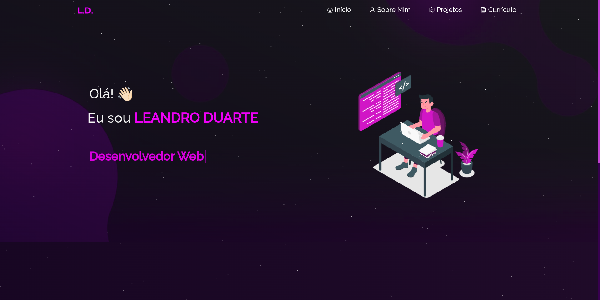

 

  

  <h3 align="center">Portfólio</h3>

  

    Trata-se de um site ao qual estou utilizando como portfólio.
     
     
  

<!-- TABLE OF CONTENTS -->

  
Conteúdo

  <ol>
    <li>
      <a href="#sobre">Sobre o Projeto</a>
      <ul>
        <li><a href="#built">Instalando a aplicação</a></li>
      </ul>
    </li>
    <li><a href="#uso">Usando</a></li>
    <li><a href="#licenca">Licença</a></li>
    <li><a href="#contato">Contato</a></li>
  </ol>

<!-- ABOUT THE PROJECT -->
## Sobre o Projeto

Este projeto tem como objetivo me fornecer um portfólio para que outras pessoas conheçam melhor sobre o meu trabalho.

  

(<a href="#readme-top">Topo</a>)

### Instalando a aplicação

Antes de começarmos, é importante que você tenha o `node.js` e `npm` instalados em sua máquina

1. Digite: `npm install` na pasta raiz do projeto e espere a instalação das dependências:

2. Terminado a instalação, basta rodar `npm start` que o projeto deve iniciar em <a href="http://localhost:3000/">http://localhost:3000/</a>
 
3. Configure-o de acordo com suas necessidades.

(<a href="#readme-top">Topo</a>)

## Usando

Após relizar a instalação você pode realizar o deploy de sua aplicação gratuitamente em <a href="https://vercel.com/">Vercel</a>. Se estiver tendo dificuldades, lenha a <a href="https://vercel.com/guides/deploying-react-with-vercel">Documentação</a>

(<a href="#readme-top">Topo</a>)

## Licença

Esse portfólio não está distribuído com nenhuma licença.

(<a href="#readme-top">Topo</a>)

## Contato

1. Hotmail - [Envie-me um email](leandroduarte2012@hotmail.com)
2. Linkedin - [Envie-me uma DM](https://linkedin.com/in/ldnovaes)

(<a href="#readme-top">Topo</a>)

